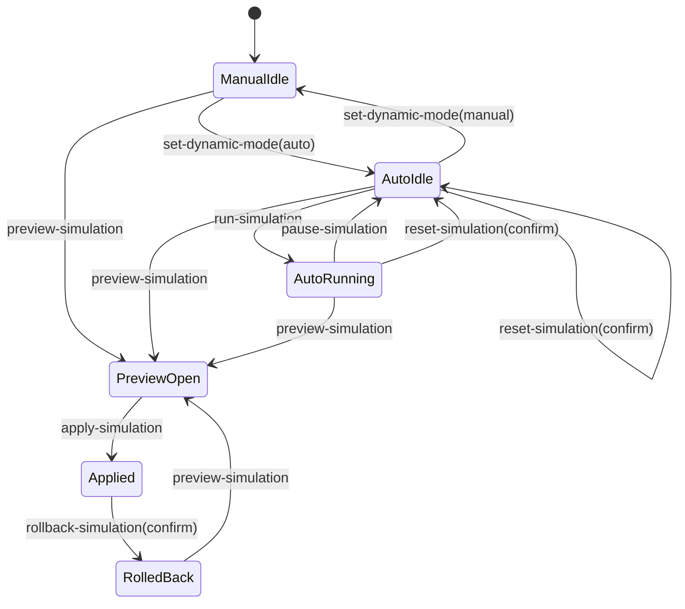

# Phase 05 Dynamic Pricing Simulation State Diagram

## Notes
- `apply-simulation` marks the related product with a visible `Simulation` tag.
- Rollback is protected by confirmation and uses a local in-memory stack.
- State persistence is in-browser only and intentionally non-production.
